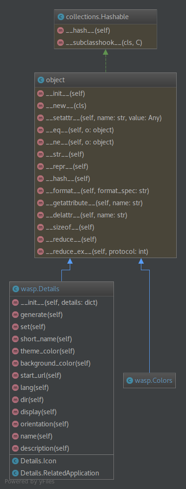

wasp
======

[](https://www.codetriage.com/devinmatte/wasp)
[](http://www.firsttimersonly.com/)

Wasp generates and creates basic resources for a modern web app.
Initializes a project with a manifest, package, and helps you tag versions effectively.

Named Wasp from the idea that wasps invented paper long before the first human thought to put his thoughts down on a sheet of papyrus.

Manifest
--------
Helps to generate a [web manifest](https://developer.mozilla.org/en-US/docs/Web/Manifest) for use in any modern web app. The goal being to make generating one easy, as a single command setup.
```
wasp init [-m --manifest]
```

Package
--------
Helps to generate a [package.json](https://docs.npmjs.com/files/package.json) for NPM or other tools that use this configuration. It creates a `package.json` to the NPM spec.
```
wasp init [-p --package]
```

Tagging
-------
Not currently implemented. Come back in a few versions
```
wasp tag v1.0.5
```

Build
-----
To build the debian package, update the `changelog` and then run:
```
debuild -us -uc
```

Design
------

Right now there's no format design pattern in use. The current goal is to get a functioning tool.
I would like to follow a formally defined design pattern, but until I determine one, this is the current design.


